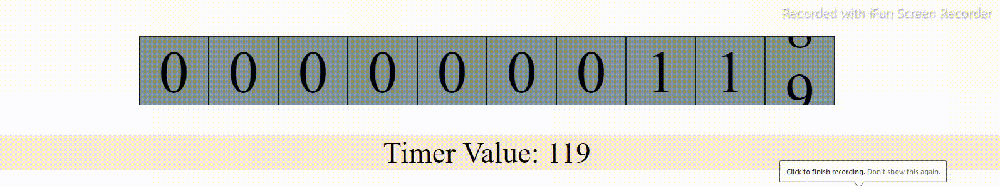

# VisualTimer

Implementation of a simple timer with 2 approaches:
1. Using requestAnimationFrame & manually implementing scroll behaviour
2. Using setTimeout & scroll-behavior: smooth;

###### (Demo uses requestAnimationFrame approach)

#### Note: requestAnimationFrame() calls are paused in most browsers when running in background tabs

## Tech Stack
- Javascript
- CSS
- HTML

## Approach
### Using requestAnimationFrame:
- requestAnimationFrame() is executed right before the browser does a repaint operation. On most browsers this method is called 60 times in a second (60 frames per second);
- We use this method & the time provided by it to show stopwatch time (using only number of seconds passed)
- We call this method again and again before the repaint operation
- For each number in the timer, we scroll to next number if the value is changed.
- Scrolling to next number happens in 24 frames
  - We have to scroll exactly the height of a single box to scroll to the next one
  - In 24 frames(16ms * 24 = 384ms on modern browsers ) we implement the manual scrolling mechanism to show a visual hint of changing numbers.
  - `node.scrollTop+=(boxDimention/noOfScrollFrames);` 
  - If the new number to scroll to is 0, we scroll directly to it without animating the scroll.
